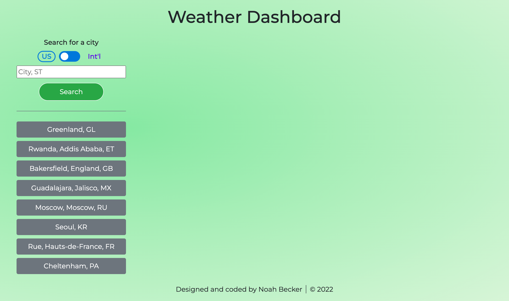
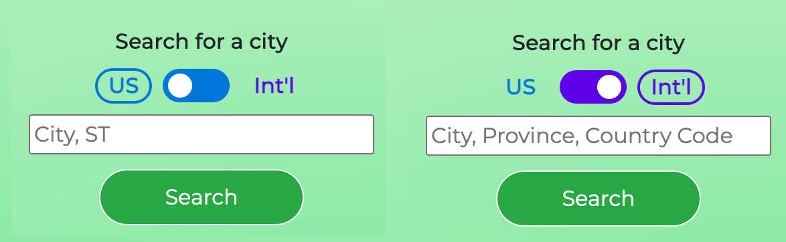
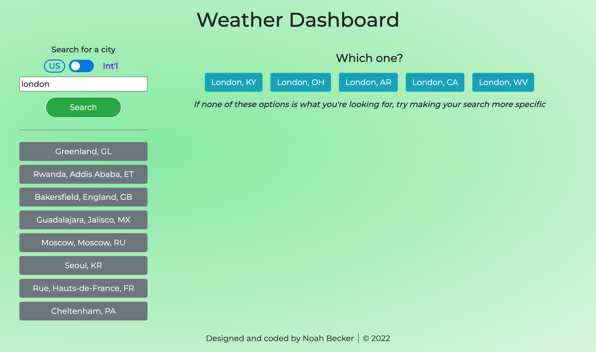
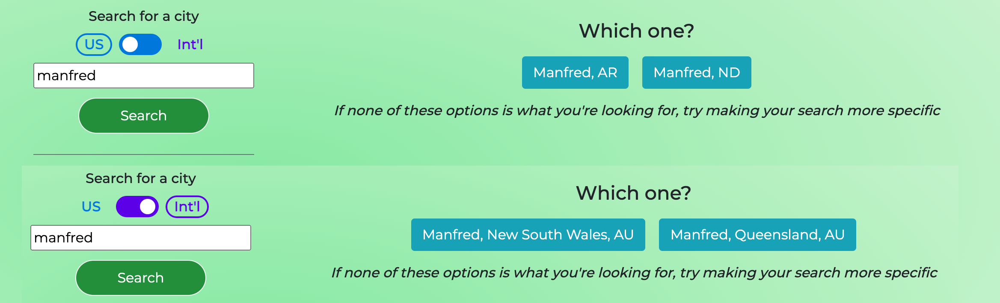
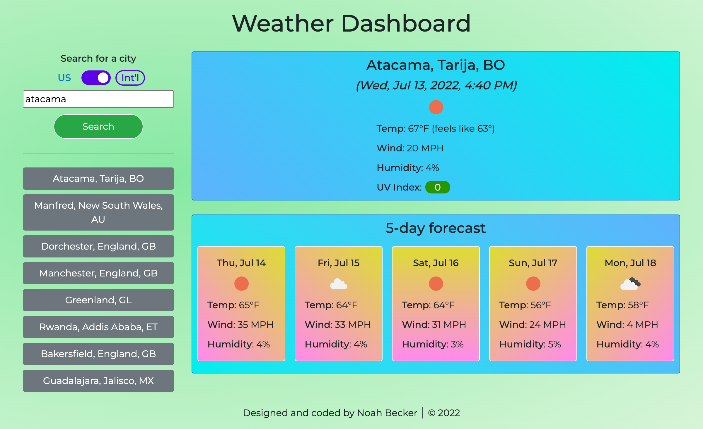
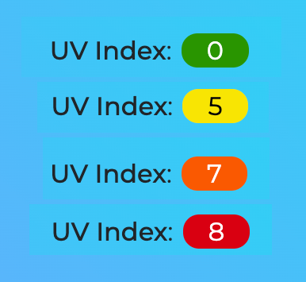

# Weather Dashboard

    

## Repo
[https://github.com/noah35becker/weather-dashboard](https://github.com/noah35becker/weather-dashboard)

## Live application
[https://noah35becker.github.io/weather-dashboard/](https://noah35becker.github.io/weather-dashboard/)

## Description
This application provides current and 5-day-forecast weather information for different US and international cities.

<i><b>
## Table of contents
- [Credits](#credits)
- [License](#license)
- [Features](#features)
- [Contributing](#contributing)
- [Questions](#questions)
- [Screenshots](#screenshots)

</i></b>

## Credits

### Creator
- Noah Becker ([GitHub](https://github.com/noah35becker))

### Third-party assets
- [OpenWeather Geocoding API](https://openweathermap.org/api/geocoding-api)
- [OpenWeather One Call API](https://openweathermap.org/api/one-call-api) (provides weather data)
- [Luxon](https://moment.github.io/luxon/#/)

## License

Learn more about this license [here](https://choosealicense.com/licenses/lgpl-3.0).

## Features
- Toggle switch for US vs. int'l cities
- Search history (saved in browser's `localStorage`)
- Weather condition icons
- Color-coded UV Index

## Contributing
Feel free to fork this project's [repo](https://github.com/noah35becker/weather-dashboard), contribute code, and submit pull requests [here](https://github.com/noah35becker/weather-dashboard/pulls)!

Contributors to this project must follow all guidelines set forth by the [Contributor Covenant](https://www.contributor-covenant.org/version/2/1/code_of_conduct/).

## Questions
My GitHub username is [noah35becker](https://github.com/noah35becker).

If you have any questions, I'd be glad to hear from you—contact me at [noahbeckercoding@gmail.com](mailto:noahbeckercoding@gmail.com).

## Screenshots
The initial state (with the 8 most recently searched cities visible in the search history)
 
 

 

 
Different suggested search syntaxes for US vs. int'l searches
 
 

 

 
A search for "london" in the US yields 5 (the maximum number of) possible results
 
 

 

 
A search for "manfred" yields different results for US vs. int'l searches
 
 

 

 
The current weather + a 5-day forecast for Atacama, Tarija, Bolivia (with this city now appearing at the top of the search history)
 
 

 

 
Color-coding for different UV index categories (low, moderate, high, very high)
 
 

 